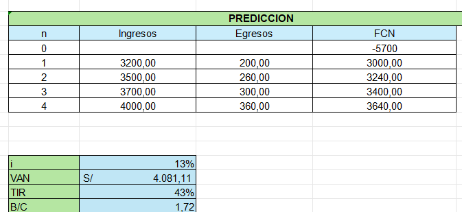
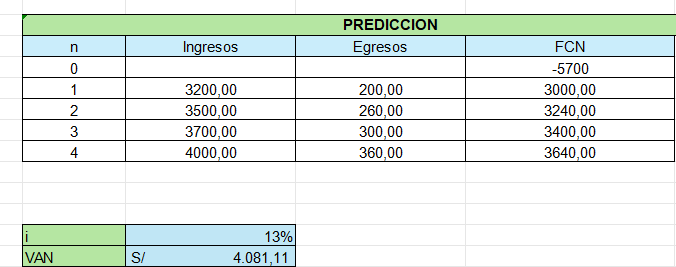
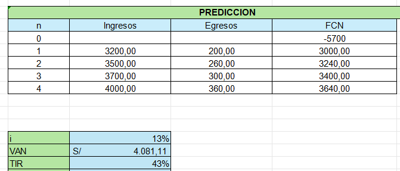

[comment]: 

**UNIVERSIDAD PRIVADA DE TACNA**

**FACULTAD DE INGENIERIA**

**Escuela Profesional de Ingeniería de Sistemas**

**Proyecto Red Social UPT***

Curso: *Patrones de Software*

Docente: *Mag. Ing. Patricio Cuadros Quiroga*

Integrantes:

***Cutipa Gutierrez, Ricardo (2021069827)***

***Malaga Espinoza, Ivan (2021071086)***

***Chino Rivera, Angel (2021069830)***

**Tacna – Perú**

***2026***

**  
**

\pagebreak

Sistema *Red Social UPT – Plataforma Social Universitaria basada en Microservicios*

Informe de Factibilidad

Versión *{1.0}*

|CONTROL DE VERSIONES||||||
| :-: | :- | :- | :- | :- | :- |
|Versión|Hecha por|Revisada por|Aprobada por|Fecha|Motivo|
|1\.0|RCG|IME|ACR|06/04/2026|Versión Original|

\pagebreak

# **INDICE GENERAL**

[1. Descripción del Proyecto](#_Toc52661346)

[2. Riesgos](#_Toc52661347)

[3. Análisis de la Situación actual](#_Toc52661348)

[4. Estudio de Factibilidad](#_Toc52661349)

[4.1 Factibilidad Técnica](#_Toc52661350)

[4.2 Factibilidad económica](#_Toc52661351)

[4.3 Factibilidad Operativa](#_Toc52661352)

[4.4 Factibilidad Legal](#_Toc52661353)

[4.5 Factibilidad Social](#_Toc52661354)

[4.6 Factibilidad Ambiental](#_Toc52661355)

[5. Análisis Financiero](#_Toc52661356)

[6. Conclusiones](#_Toc52661357)

\pagebreak

**<u>Informe de Factibilidad</u>**

1. **Descripción del Proyecto**

### 1.1 Nombre del Proyecto

**Red Social UPT – Plataforma Social Universitaria basada en Microservicios**

### 1.2 Duración del Proyecto

El proyecto tiene una duración estimada de **4 meses (16 semanas)**, correspondiente al semestre académico **2026-I**, comprendido entre los meses de **abril y julio de 2026**.

### 1.3 Descripción

La **Red Social UPT** es una plataforma digital orientada a la comunidad estudiantil de la Universidad Privada de Tacna, diseñada para facilitar la comunicación e interacción académica y social dentro de un entorno institucional seguro.

El sistema consiste en el desarrollo de una aplicación web basada en arquitectura de microservicios, que permite a los estudiantes autenticarse mediante su cuenta institucional `@virtual.upt.pe`, crear publicaciones, generar historias, interactuar con otros usuarios y organizarse según su facultad y escuela profesional.

Actualmente, los estudiantes recurren a plataformas externas como Facebook o WhatsApp para coordinar actividades académicas, lo cual genera limitaciones en términos de privacidad, control institucional y organización de la información. Esta propuesta plantea una solución centralizada que responde directamente a dichas problemáticas.

El sistema se implementa utilizando tecnologías modernas orientadas a escalabilidad, despliegue en la nube y buenas prácticas de desarrollo:

- PHP / Lumen  
- MySQL  
- Docker  
- Terraform  
- GitHub Actions  
- SonarQube  
- VPS con sistema operativo Debian  

La solución propuesta permite consolidar un entorno digital propio de la universidad, garantizando seguridad en el acceso, organización de la información académica y una experiencia de usuario alineada al contexto universitario.

 ## 1.4 Objetivos

### 1.4.1 Objetivo General

Desarrollar una plataforma web de red social universitaria basada en arquitectura de microservicios que permita a los estudiantes de la Universidad Privada de Tacna interactuar, compartir contenido académico y social, y comunicarse de forma segura mediante el uso exclusivo de cuentas institucionales con dominio `@virtual.upt.pe`, garantizando un entorno digital controlado, escalable y orientado a la comunidad universitaria.

### 1.4.2 Objetivos Específicos

**OE1: Diseño de la arquitectura de microservicios**  
Definir la estructura del sistema mediante la separación en microservicios independientes (autenticación, publicaciones e interacciones sociales), estableciendo su comunicación a través de APIs REST y asegurando escalabilidad, modularidad y mantenibilidad del sistema.

**OE2: Implementación del sistema de autenticación institucional**  
Habilitar el registro e inicio de sesión exclusivo mediante cuentas con dominio `@virtual.upt.pe`, integrando Google OAuth y generación de tokens JWT para garantizar autenticación segura y validación de identidad institucional.

**OE3: Desarrollo del módulo de publicaciones e historias**  
Permitir a los usuarios crear publicaciones con texto e imágenes, así como historias efímeras con expiración automática, asegurando su correcta visualización en el feed en tiempo real.

**OE4: Implementación del módulo de perfiles e interacciones sociales**  
Desarrollar funcionalidades que permitan la gestión de perfiles de usuario, así como la interacción mediante likes, comentarios y segmentación por facultad y carrera, fortaleciendo la comunicación dentro de la comunidad universitaria.

**OE5: Despliegue del sistema en infraestructura en la nube**  
Implementar el sistema en una VPS con sistema operativo Debian utilizando contenedores Docker y orquestación con Docker Compose, gestionando la infraestructura mediante Terraform para garantizar reproducibilidad y automatización.

**OE6: Integración de control de calidad y seguridad del software**  
Incorporar herramientas de análisis estático y seguridad como SonarQube, Snyk o Semgrep dentro de un pipeline de CI/CD con GitHub Actions, asegurando código limpio, seguro y alineado a buenas prácticas de desarrollo.

\pagebreak

## 2. Riesgos

Los principales riesgos que podrían afectar el éxito del proyecto son:

| Riesgo                      | Descripción                                  | Impacto | Mitigación               |
|----------------------------|----------------------------------------------|---------|--------------------------|
| Falta de tiempo            | Retraso en el desarrollo por carga académica | Alto    | Planificación semanal    |
| Fallas en VPS              | Problemas en el servidor                     | Medio   | Backup y pruebas locales |
| Problemas en microservicios| Errores en la integración                    | Alto    | Pruebas continuas        |
| Fallas de seguridad        | Vulnerabilidades en PHP                      | Alto    | SonarQube y Snyk         |
| Problemas en Docker        | Configuración incorrecta                     | Medio   | Documentación y pruebas  |
| Falta de coordinación      | Desorganización del equipo                   | Alto    | Reuniones semanales      |

## 3. Análisis de la Situación Actual

### 3.1 Planteamiento del Problema

Actualmente, los estudiantes de la Universidad Privada de Tacna no cuentan con una plataforma digital institucional que centralice la comunicación académica y social.

La comunicación se realiza mediante redes sociales externas como Facebook, WhatsApp e Instagram, lo que genera problemas como:

- Falta de privacidad  
- Información dispersa  
- Ausencia de control institucional  
- Falta de segmentación por carrera  
- Riesgo de cuentas falsas  
- Dependencia de plataformas externas  

Esto genera la necesidad de una red social universitaria propia que permita la comunicación segura y organizada dentro de la institución.

### 3.2 Consideraciones de Hardware y Software

#### Hardware

- Computadoras del equipo de desarrollo  
- VPS Debian  
- Conexión a Internet  
- Servidor virtual  
- Almacenamiento SSD  

#### Software

- PHP 8  
- Lumen Framework  
- MySQL  
- Docker  
- Terraform  
- GitHub  
- SonarQube  
- Snyk  
- Semgrep  
- Visual Studio Code  
- Navegadores web  
## 4. Estudio de Factibilidad

El estudio de factibilidad permite evaluar la viabilidad del proyecto en términos técnicos y económicos, considerando los recursos disponibles, las tecnologías seleccionadas y los costos asociados al desarrollo e implementación del sistema.

### 4.1 Factibilidad Técnica

El proyecto **Red Social UPT** es técnicamente viable, ya que se basa en tecnologías modernas, de código abierto y ampliamente utilizadas en el desarrollo de sistemas web escalables.

El sistema se implementa mediante una arquitectura de microservicios, compuesta por tres servicios principales:

- Autenticación institucional  
- Publicaciones e historias  
- Perfiles e interacciones sociales  

Estos servicios se comunican mediante API REST y utilizan tokens JWT para garantizar la seguridad en la comunicación.

La plataforma será accesible desde navegadores web en computadoras y dispositivos móviles, asegurando compatibilidad y usabilidad mediante pruebas de rendimiento y validación en distintos entornos.

El microservicio de autenticación valida cuentas institucionales con dominio `@virtual.upt.pe`, restringiendo el acceso únicamente a miembros de la universidad.

El sistema permite:

- Publicación de contenido en tiempo real  
- Gestión de historias efímeras  
- Interacciones sociales (likes, comentarios)  
- Organización por facultad y carrera  

El despliegue se realiza en una VPS con sistema operativo Debian, utilizando Docker para la contenerización y Terraform para la automatización de la infraestructura.

Además, se integran herramientas de calidad y seguridad como:

- SonarQube  
- Snyk / Semgrep  
- GitHub Actions  

Estas herramientas garantizan código limpio, seguro y mantenible.

A pesar de desafíos como la integración de microservicios y el despliegue en la nube, el uso de tecnologías consolidadas permite afirmar que el proyecto es técnicamente viable.

### 4.2 Factibilidad Económica

El análisis económico evalúa los costos necesarios para el desarrollo e implementación del sistema en relación con los beneficios obtenidos.

#### 4.2.1 Costos Generales

| Ítem | Descripción          | u.m.   | Costo Unitario | Cantidad | Costo Total |
|------|---------------------|--------|----------------|----------|-------------|
| 1    | Papel Bond          | Millar | S/ 20.00       | 2        | S/ 40.00    |
| 2    | Lapiceros           | Caja   | S/ 10.00       | 1        | S/ 10.00    |
| 3    | Folder              | Unidad | S/ 1.00        | 10       | S/ 10.00    |
| 4    | Recarga impresora   | Unidad | S/ 35.00       | 1        | S/ 35.00    |
|      |                     |        |                | **Total**| **S/ 95.00**|

#### 4.2.2 Costos Operativos

| Ítem | Descripción | Costo Unitario | Meses | Total   |
|------|-------------|----------------|-------|---------|
| 1    | Internet    | S/ 100         | 4     | S/ 400  |
| 2    | Luz         | S/ 80          | 4     | S/ 320  |
|      |             |                | **Total** | **S/ 720** |

#### 4.2.3 Costos de Infraestructura (VPS - Hetzner)

**Resumen de infraestructura:**

- Proveedor: Hetzner Cloud  
- 1 servidor VPS (cx22: 2 vCPU, 4 GB RAM, 40 GB SSD)  
- 1 volumen adicional de 20 GB  
- Firewall configurado (SSH, HTTP, HTTPS)  
- Uso continuo (24/7 – 730 horas/mes)  

**Costos estimados mensuales:**

| Recurso             | Especificación                  | Costo |
|--------------------|--------------------------------|-------|
| VPS cx22           | 2 vCPU, 4 GB RAM, 40 GB SSD    | $4.75 |
| Volumen 20 GB      | Almacenamiento MySQL           | $0.96 |
| Firewall           | Incluido                       | $0.00 |
| IPv4 pública       | Incluida                       | $0.00 |
| Tráfico            | 20 TB incluidos                | $0.00 |
| **TOTAL MENSUAL**  |                                | **$5.71** |

**Costo anual estimado:** ~$68.52 USD  

**Notas:**

- Infraestructura suficiente para ejecutar todos los microservicios mediante Docker  
- Basado en configuración real con Terraform  
- Costos pueden aumentar si el sistema escala (más servidores o servicios)  

#### 4.2.4 Costos de Personal

| Rol                          | Cantidad | Pago/Hora | Horas | Total    |
|------------------------------|----------|-----------|-------|----------|
| Backend                      | 1        | S/ 20     | 60    | S/ 1200  |
| Microservicios               | 1        | S/ 20     | 60    | S/ 1200  |
| DevOps y Documentación       | 1        | S/ 20     | 60    | S/ 1200  |
|                              |          |           |       | **S/ 3600** |

#### 4.2.5 Costo Total del Proyecto

| Categoría             | Costo          |
|----------------------|----------------|
| Costos Generales     | S/ 95          |
| Costos Operativos    | S/ 720         |
| Costos de Personal   | S/ 3600        |
| Infraestructura VPS  | ~$5.71 USD/mes |
| **TOTAL**            | **S/ 4415 + costo VPS** |

### 4.3 Factibilidad Operativa

El proyecto es operativamente viable, ya que la plataforma permitirá a los estudiantes de la Universidad Privada de Tacna interactuar, comunicarse y compartir contenido de manera rápida y eficiente dentro de un entorno digital institucional.

El sistema contará con una interfaz web intuitiva y fácil de usar, permitiendo a los usuarios:

- Iniciar sesión con su cuenta institucional  
- Publicar contenido e interactuar en el feed  
- Gestionar su perfil académico  
- Comunicarse con otros estudiantes  

Además, el sistema reducirá la dependencia de plataformas externas como redes sociales genéricas, mejorando el control institucional de la información.

Se contempla capacitación básica para los usuarios y documentación del sistema, asegurando su correcto uso y mantenimiento.

### 4.4 Factibilidad Legal

El proyecto cumple con la normativa legal vigente en el Perú, especialmente en lo relacionado con la protección de datos personales.

Se garantizará:

- Protección de datos de los usuarios  
- Uso seguro de la información académica  
- Acceso restringido mediante cuentas institucionales  

El sistema respetará la Ley de Protección de Datos Personales y el uso adecuado de tecnologías, evitando vulneraciones legales durante su implementación.

### 4.5 Factibilidad Social

El proyecto tendrá un impacto positivo en la comunidad universitaria, ya que mejora la comunicación y organización entre los estudiantes.

Los beneficios incluyen:

- Mayor integración entre estudiantes  
- Mejor acceso a información académica  
- Espacio digital institucional seguro  
- Fomento de la interacción académica y social  

Además, impulsa la digitalización dentro de la universidad, promoviendo el uso de tecnología en el entorno educativo.

### 4.6 Factibilidad Ambiental

El proyecto no genera un impacto ambiental significativo, ya que está basado en tecnología digital.

Contribuye a:

- Reducción del uso de papel  
- Disminución de procesos físicos  
- Uso eficiente de recursos tecnológicos  

Se promueve el uso responsable de la infraestructura digital y equipos informáticos.

## 5. Análisis Financiero

El análisis financiero evalúa la rentabilidad del proyecto considerando los costos de desarrollo frente a los beneficios obtenidos.

### 5.1 Justificación de la Inversión

#### 5.1.1 Beneficios del Proyecto

**Beneficios Tangibles**

- Reducción del uso de herramientas externas  
- Optimización de la comunicación estudiantil  
- Centralización de la información  
- Ahorro en recursos administrativos digitales  

**Beneficios Intangibles**

- Mejora de la organización universitaria  
- Mayor seguridad en la comunicación  
- Fortalecimiento de la identidad institucional  
- Modernización tecnológica de la universidad  
- Mejora en la experiencia del usuario  

#### 5.1.2 Criterios de Inversión

##### 5.1.2.1 Relación Beneficio/Costo (B/C)

La relación beneficio/costo permite evaluar si los beneficios superan los costos del proyecto.

**B/C = 1.72**

Esto indica que el proyecto es rentable, ya que los beneficios son mayores que los costos.

##### 5.1.2.2 Valor Actual Neto (VAN)

El VAN representa el valor actual de los beneficios futuros del proyecto.

**VAN = S/ 4,081.11**  
**i = 13%**

El resultado positivo indica que el proyecto es económicamente viable.

##### 5.1.2.3 Tasa Interna de Retorno (TIR)

La TIR mide la rentabilidad del proyecto en porcentaje.

**TIR = 43%**

Este valor supera el costo de oportunidad (13%), indicando alta rentabilidad.

## 6. Conclusiones

El análisis de factibilidad demuestra que el proyecto **Red Social UPT** es viable desde los puntos de vista técnico, económico, operativo, legal, social y ambiental.

Los indicadores financieros reflejan:

- VAN positivo  
- TIR superior al costo de oportunidad  
- Relación beneficio/costo mayor a 1  

Esto confirma que el proyecto es rentable y sostenible.

La implementación del sistema permitirá mejorar la comunicación universitaria, centralizar la información, optimizar procesos digitales y ofrecer una plataforma segura y moderna para la comunidad estudiantil.

---
